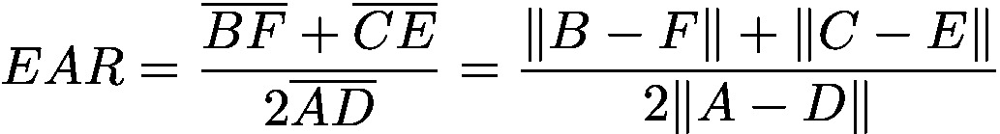
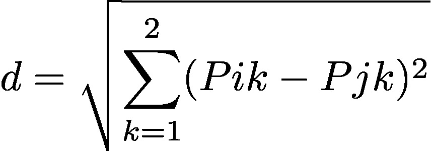
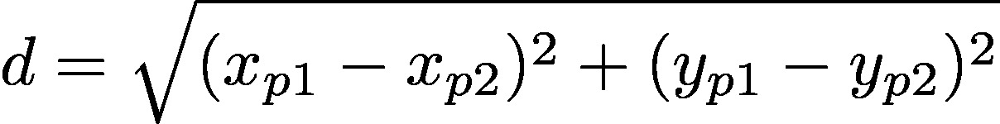

# Neural Facial Expression Detectors

🇺🇸 English | 🇧🇷 [Português](README.md)

[](#)
[](#)
[](#)
[](#)
[](LICENSE)


<pre>This experiment is part of the Extension Project "LAC Knowledge Repository".
SIEX Registration: 403654.
A project that provides reference code and documentation for developments
at the Computational Arts Laboratory of the School of Fine Arts at UFMG,
extending access to this material to the general free software and hardware community.</pre>

This project aims to implement human-machine interfaces whose input values are generated by facial expressions. These expressions are interpreted by computer vision using neural networks.
The neural networks used here were trained to detect the human face and index facial landmarks in real time.
Facial landmarks are bidimensional vectors (x,y) whose Euclidean distances can be measured to infer gestures of the facial expression.

  


The examples in this project were written and tested in Python 3.10 with the OpenCV library.

## Interfaces based on EAR (Eye Aspect Ratio)

In the "Olhos" (Eyes) folder, we have two interfaces that send OSC commands to control other software:

### Camera_OSC_Detector_Neural_Piscadas.py
Detects single eyelid closures in each iteration.
Upon detecting a blink, an OSC command is sent.
Thus, the software can control other applications, triggering events.

In the "Interfaces_Controlaveis_OSC" folder, we have an example program.
The Processing sketch "Bolinhas_OSC_PISCADAS" generates filled circles with randomized positioning and colors for each blink.

### Camera_OSC_Detector_Neural_OlhosFechados.py
Detects persistent eyelid closure for a determined period of iterations.
If the eyes remain closed in that interval, an OSC command is sent.
Upon opening the eyes, another OSC command is fired.
Thus, the software can command other programs, toggling between two states.

### Code Details and References
The optimized face detection model is based on RFB-320:<br>
(Approximate cost between 90~109 MFlops)<br>
https://github.com/Linzaer/Ultra-Light-Fast-Generic-Face-Detector-1MB

This program was based on the coding of:<br>
Cunjian Chen (ccunjian@gmail.com) (pythorch_face_landmark)<br>
https://github.com/cunjian/pytorch_face_landmark.git

The facial landmark standard used here is the 68-point model (Multi-PIE 68):<br>


This notation pattern was introduced by C. Sagonas, E. Antonakos, G, Tzimiropoulos, S. Zafeiriou, M. Pantic.<br>
https://ibug.doc.ic.ac.uk/media/uploads/documents/sagonas_cvpr_2013_amfg_w.pdf <br>
The trained detection model, via HOG and regression trees, was taken from the DLIB library created by Davis E. King.

The eye aspect ratio calculation follows the parameters indicated in the article:<br>
"Real-Time Eye Blink Detection using Facial Landmarks" by Tereza Soukupová and Jan Cech <br>
https://vision.fe.uni-lj.si/cvww2016/proceedings/papers/05.pdf

### About the EAR (Eye Aspect Ratio) Calculation

The width of the eye (in pixels) changes relative to the distance from the camera. Therefore, we use the measurement of the width of the eye as a baseline comparison for the height measurement to infer its openness.

Each facial landmark is an ordered pair corresponding to the pixel index where it is located. That is, it is a vector (x,y) whose values refer to the distance in pixels from the image origin point (x=0, y=0).
For each eye, 6 of these landmarks are used: 2 pairs (4 points) for the height and one pair (2 points) for the width, as shown in the figure below:


EAR (Eye Aspect Ratio) Equation:
<p></p>

Therefore, the equation is a ratio between the sum of the Euclidean distances of the eye's height vectors and twice the Euclidean distance of the width vectors.

Since they are bidimensional vectors, the Euclidean distance between two points is given by:
<p></p>

This means that the distance between points is obtained by taking the square root of the sum of the squared differences of the vector coordinates.
In the notation, each point has two coordinates (x and y), indicated by the "2" above the sigma (summation symbol). Thus, the summation will have two iterations, one for the x values and another for the y values.

Since there are two distinct points, indices i and j are used as the coordinate values of each point in the current iteration. The "k" is a constant of value 1, indicating that there will be no increment in the indices at each iteration.

In the first iteration, Pi is the x-value of the first point (xp1), while Pj is the x-value of the second point (xp2) (one minus the other is the projected distance on the X axis).
In the second iteration, Pi is the y-value of the first point (yp1), while Pj is the y-value of the second point (yp2) (one minus the other is the projected distance on the Y axis).

This translates the first notation into:
<p></p>

By obtaining the projected distances on the X and Y axes, we get two sides of a right triangle.
Thus, if we take the projection in X as "side a" and the projection in Y as "side b", what we want to find is "side c", formed by the diagonal connecting the points.
This fits into the Pythagorean theorem, where the distance between the vertices (given points) is the hypotenuse (side c).
Therefore, the square root of the sum of these squared distances gives us the Euclidean distance, i.e., the missing side: the hypotenuse.


## How to Configure and Run the Project

To run this project on your machine quickly and in isolation, we recommend using **Miniconda** (a lightweight version of Anaconda without a graphical interface, only ~80MB).

### 1. Installing Miniconda
1. Download the Miniconda installer for your operating system from the [Official Miniconda Downloads Page](https://docs.conda.io/en/latest/miniconda.html).
2. Run the installer and complete the installation keeping the default system options.

### 2. Configuring the Environment
1. Open the start menu, search for **Anaconda Prompt (miniconda3)** (on Windows) or open the terminal (on macOS/Linux) and navigate to this repository's folder:
   ```bash
   cd path/to/the/repository
   ```
2. Create a virtual environment with Python 3.10 (recommended and stable version):
   ```bash
   conda create -n detector_facial python=3.10 -y
   ```
   > [!IMPORTANT]
   > **Resolving Terms of Service Error (`CondaToSNonInteractiveError`)**:
   >
   > If during environment creation Conda displays a message requesting acceptance of Anaconda's terms of service, run the command below in the terminal to accept them:
   > ```bash
   > conda tos accept
   > ```
   > *(Or run the creation command passing the free conda-forge channel: `conda create -n detector_facial -c conda-forge python=3.10 -y`)*

3. Activate the created virtual environment:
   ```bash
   conda activate detector_facial
   ```
4. Install the essential and lightweight project dependencies from the `requirements.txt` file:
   ```bash
   pip install -r requirements.txt
   ```

### 3. Running the Detectors
Make sure your webcam is connected. The scripts use your **camera's original factory resolution** to ensure maximum compatibility and FPS stability.

Additionally, the scripts have a **black screen discard** mechanism: if the camera index opens an inactive virtual device (like OBS Virtual Cam), it detects that the frame is empty and automatically tries the other camera index.

#### Selecting the Camera Index
By default, the scripts try to open camera index `1` and then fall back to `0`. You can **force a specific index** by passing it as an argument at the end of the command:

* To run the **Blink Detector** on camera `1`:
  ```bash
  python Olhos/Camera_OSC_Detector_Neural_Piscadas.py 1
  ```
* To run the **Blink Detector** on camera `0`:
  ```bash
  python Olhos/Camera_OSC_Detector_Neural_Piscadas.py 0
  ```
* To run the **Closed Eyes Detector** on camera `1`:
  ```bash
  python Olhos/Camera_OSC_Detector_Neural_OlhosFechados.py 1
  ```
* Press the `q` key on the camera preview window to close the script.

---

## Common Troubleshooting

### A. Upside-down Image (Vertical Flip)
The original code came with inverted axes (vertical and horizontal) due to the capture hardware used at the time.
If your webcam image appears vertically inverted (upside down), locate the flip block in the corresponding script (inside the main `while True` loop):
```python
# In the script used:
# orig_image = cv2.flip(orig_image, 0)  # Uncomment this line to enable vertical flip
orig_image = cv2.flip(orig_image, 1)    # Controls horizontal flip (mirror effect)
```
Simply comment/uncomment the `cv2.flip(orig_image, 0)` line according to your capture device's needs.

### B. `torch` Import Failure (PyTorch)
The scripts have been cleaned up to run ultra-lightweight using only OpenCV, NumPy, and ONNX Runtime. If you receive a `ModuleNotFoundError: No module named 'torch'` error, make sure the [__init__.py](file:///X:/GEMINY/Interfaces_com_Redes_Neurais_e_Expressao_Facial/Olhos/vision/utils/__init__.py) file is completely empty. This prevents training utility files that import PyTorch from being called unnecessarily.

### C. Model Path Errors (`NoSuchFile`)
The paths to the `.onnx` files and labels (`voc-model-labels.txt`) are now resolved **dynamically** based on the directory where the script is located. This allows you to safely run the scripts from any working directory in the terminal.
