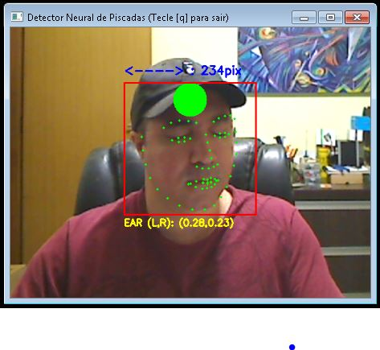

# Detectores Neurais de Expressão Facial

 

Esse projeto visa implementar interfaces humano-máquina, cujos valores de entrada
são gerados por expressões faciais. Essas expressões são interpretadas por visão computacional, através de redes neurais.
As redes neurais utilizadas aqui foram treinadas para detectar o rosto humano e indexar marcadores faciais em tempo real.
Os marcadores faciais são vetores (x,y) cujas distâncias euclidianas podem ser medidas para
inferência de gestos da expressão facial.

Os exemplos deste projeto foram escritos e testados em Python 3.7.8 com a biblioteca OpenCV 4.4.0.

## Interfaces em função do EAR (Eyes Aspect Ratio)

Na pasta "Olhos" temos duas interfaces que enviam comandos OSC para controlar outros softwares:

### Camera_OSC_Detector_Neural_Piscadas.py
Detecta cada fechamento singular das pálpebras em cada iteração.
Ao detectar o fechamento, um comando OSC é enviado.
Assim o software pode comandar outros softwares, disparando eventos.

Na pasta "Interfaces_Controlaveis_OSC", temos um programa exemplo.
O sketch em Processing "Bolinhas_OSC_PISCADAS" gera circulos preenchidos
com posicionamento e cores randomizadas a cada piscada.

### Camera_OSC_Detector_Neural_OlhosFechados.py
Detecta o fechamento persistente das pálpebras por um período determinado de iterações.
Caso os olhos permaneçam fechados nesse intervalo, um comando OSC é enviado.
Ao abrir os olhos, outro comando OSC é disparado.
Assim o software pode comandar outros softwares, alternando entre dois estados.

### Detalhes do código e referências
O modelo otimizado de detecção de rosto é baseado na RFB-320: 
(custo aproximado entre 90~109 MFlops) 
https://github.com/Linzaer/Ultra-Light-Fast-Generic-Face-Detector-1MB

Esse programa foi baseado na codificação de: 
Cunjian Chen (ccunjian@gmail.com) (pythorch_face_landmark)
https://github.com/cunjian/pytorch_face_landmark.git

O padrão de marcadores faciais utilizado aqui é o de 68 pontos (Multi-PIE 68): 
Por C. Sagonas, E. Antonakos, G, Tzimiropoulos, S. Zafeiriou, M. Pantic. 
https://ibug.doc.ic.ac.uk/media/uploads/documents/sagonas_cvpr_2013_amfg_w.pdf  
O modelo treinado de detecção, via HOG e árvores de regressão,
foi retirado da biblioteca DLIB criada por Davis E. King.

O cálculo de aspecto dos olhos segue os parâmetros indicados no artigo: 
"Real-Time Eye Blink Detection using Facial Landmarks"
de Tereza Soukupová e Jan Cech  
https://vision.fe.uni-lj.si/cvww2016/proceedings/papers/05.pdf

Breve explicação:

A largura dos olhos, em pixels, se modifica em relação à distância
da câmera. Assim, utiliza-se a medição dessa largura do olho como base de
comparação com a medição da altura, para inferir a sua abertura.

Cada marcador facial é um vetor (x,y) correspondente ao pixel indexado.
Para cada olho, utilizam-se 6 desses marcadores, sendo
2 pares(4 pontos) para a altura e um par(2 pontos) para a largura.

            B*   C*
        A*           D*
            F*   E*

Equação de EAR (Eye Aspect Ratio)
<pre>
EAR = || B - F || + || C - E || / (2 * || A - D ||)
</pre>
Portanto, a equação é uma razão entre a soma das distâncias euclidianas dos vetores da
altura do olho em função do dobro da distância euclidiana dos vetores da largura.
