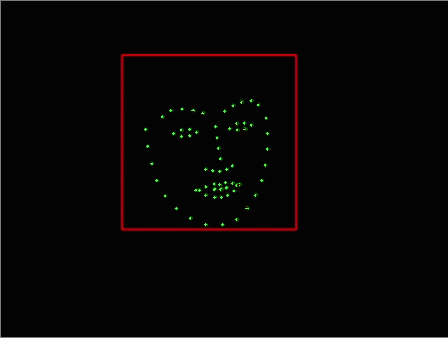
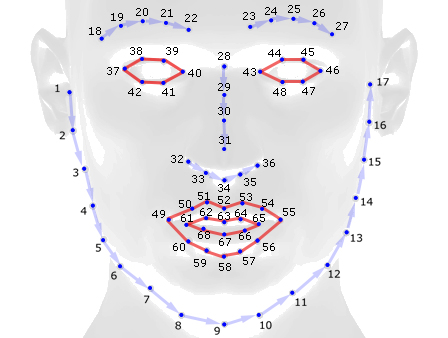
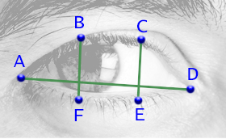
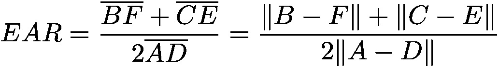
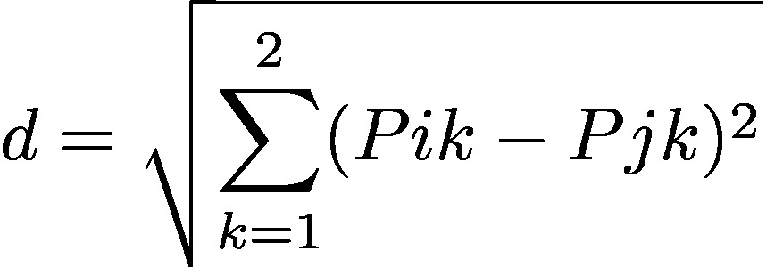
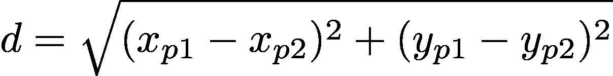

# Detectores Neurais de Expressão Facial

<pre>Este experimento faz parte do Projeto de Extensão "Repositório de Conhecimento do LAC".
Registro SIEX: 403654.
Um projeto que disponibiliza código e documentação de referência para os desenvolvimentos
no Laboratório de Artes Computacionais da Escola de Belas Artes da UFMG,
estendendo o acesso a esse material à comunidade geral de software e hardware livres.</pre>

Esse projeto visa implementar interfaces humano-máquina, cujos valores de entrada
são gerados por expressões faciais. Essas expressões são interpretadas por visão computacional, através de redes neurais.
As redes neurais utilizadas aqui foram treinadas para detectar o rosto humano e indexar marcadores faciais em tempo real.
Os marcadores faciais são vetores bidimensionais(x,y) cujas distâncias euclidianas podem ser medidas para
inferência de gestos da expressão facial.

  

Os exemplos deste projeto foram escritos e testados em Python 3.7.8 com a biblioteca OpenCV 4.4.0.

## Interfaces em função do EAR (Eyes Aspect Ratio)

Na pasta "Olhos" temos duas interfaces que enviam comandos OSC para controlar outros softwares:

### Camera_OSC_Detector_Neural_Piscadas.py
Detecta cada fechamento singular das pálpebras em cada iteração.
Ao detectar o fechamento, um comando OSC é enviado.
Assim o software pode comandar outros softwares, disparando eventos.

Na pasta "Interfaces_Controlaveis_OSC", temos um programa exemplo.
O sketch em Processing "Bolinhas_OSC_PISCADAS" gera circulos preenchidos
com posicionamento e cores randomizadas a cada piscada.

### Camera_OSC_Detector_Neural_OlhosFechados.py
Detecta o fechamento persistente das pálpebras por um período determinado de iterações.
Caso os olhos permaneçam fechados nesse intervalo, um comando OSC é enviado.
Ao abrir os olhos, outro comando OSC é disparado.
Assim o software pode comandar outros softwares, alternando entre dois estados.

### Detalhes do código e referências
O modelo otimizado de detecção de rosto é baseado na RFB-320: 
(custo aproximado entre 90~109 MFlops) 
https://github.com/Linzaer/Ultra-Light-Fast-Generic-Face-Detector-1MB

Esse programa foi baseado na codificação de: 
Cunjian Chen (ccunjian@gmail.com) (pythorch_face_landmark)
https://github.com/cunjian/pytorch_face_landmark.git

O padrão de marcadores faciais utilizado aqui é o de 68 pontos (Multi-PIE 68): 

Esse padrão de notação foi introduzido por C. Sagonas, E. Antonakos, G, Tzimiropoulos, S. Zafeiriou, M. Pantic. 
https://ibug.doc.ic.ac.uk/media/uploads/documents/sagonas_cvpr_2013_amfg_w.pdf  
O modelo treinado de detecção, via HOG e árvores de regressão,
foi retirado da biblioteca DLIB criada por Davis E. King.

O cálculo de aspecto dos olhos segue os parâmetros indicados no artigo: 
"Real-Time Eye Blink Detection using Facial Landmarks"
de Tereza Soukupová e Jan Cech  
https://vision.fe.uni-lj.si/cvww2016/proceedings/papers/05.pdf

### Sobre o cálculo do EAR (Eyes Aspect Ratio)

A largura dos olhos, em pixels, muda em relação à distância
da câmera. Assim, utiliza-se a medição dessa largura do olho como base de
comparação com a medição da altura, para inferir a sua abertura.

Cada marcador facial é um par ordenado, que corresponde à indexação do píxel no qual se localiza.
Ou seja, é um vetor (x,y) cujos valores são referentes à distância em pixels do ponto de origem da imagem (x=0,y=0).
Para cada olho, utilizam-se 6 desses marcadores, sendo
2 pares(4 pontos) para a altura e um par(2 pontos) para a largura, conforme vemos na figura abaixo:

Equação de EAR (Eye Aspect Ratio)

Portanto, a equação é uma razão entre a soma das distâncias euclidianas dos vetores da
altura do olho em função do dobro da distância euclidiana dos vetores da largura.

Como são vetores bidimensionais, a distância euclidiana entre dois pontos é dada por:

Isso significa que a distância entre os pontos se dá pela extração da raiz do somatório da diferença ao quadrado dos atributos dos vetores.
Na notação, cada ponto possui dois 2 atributos (x e y), o que é indicado pelo "2" acima do sigma (símbolo de somatório).
Sendo assim, o somatório terá duas iterações, uma para os valores de x e outra para os valores de y.

Como são dois pontos distintos, utilizam-se os índices i e j como o valor do atributo de cada ponto na iteração corrente.
O "k" é uma constante de valor 1, indicando que não haverá incremento nos índices a cada iteração.

Na primeira iteração Pi é o valor de x do primeiro ponto (xp1), enquanto Pj é o valor de x do segundo ponto (xp2) (um menos o outro é a distância projetada no eixo X).
Na segunda iteração Pi é o valor de y do primeiro ponto (yp1), enquanto Pj é o valor de y do segundo ponto (yp2) (um menos o outro é a distância projetada no eixo Y).

Isso resulta na tradução da primeira notação em:

Ao obtermos as distâncias projetadas nos eixos X e Y, pela subtração dos atributos, temos dois lados de um triângulo retângulo.
Assim, se tomarmos a projeção em X como "lado a" e a projeção em Y como "lado b", o que queremos descobrir é o "lado c", formado pela diagonal que liga os pontos.
Isso se inscreve, portanto, numa equação do segundo grau. Onde a distância entre os vértices(pontos dados) é a hipotenusa (o lado c).
Por isso, a raiz do somatório dessas distâncias ao quadrado nos dará a distância euclidiana, ou seja, o lado que nos faltava saber: a hipotenusa.

