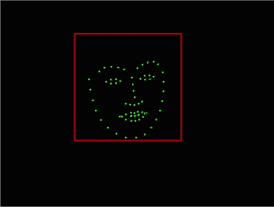
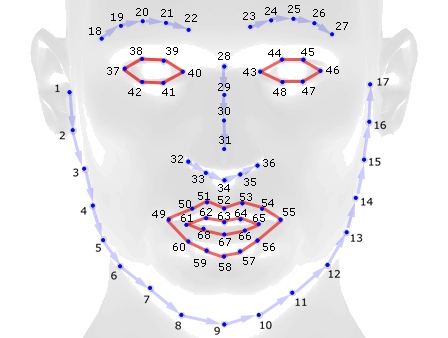
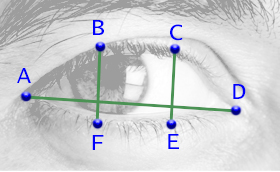

# Detectores Neurais de Expressão Facial

🇧🇷 Português | 🇺🇸 [English](README.en.md)

[](#)
[](#)
[](#)
[](#)
[](LICENSE)


<pre>Este experimento faz parte do Projeto de Extensão "Repositório de Conhecimento do LAC".
Registro SIEX: 403654.
Um projeto que disponibiliza código e documentação de referência para os desenvolvimentos
no Laboratório de Artes Computacionais da Escola de Belas Artes da UFMG,
estendendo o acesso a esse material à comunidade geral de software e hardware livres.</pre>

Esse projeto visa implementar interfaces humano-máquina, cujos valores de entrada
são gerados por expressões faciais. Essas expressões são interpretadas por visão computacional, através de redes neurais.
As redes neurais utilizadas aqui foram treinadas para detectar o rosto humano e indexar marcadores faciais em tempo real.
Os marcadores faciais são vetores bidimensionais(x,y) cujas distâncias euclidianas podem ser medidas para
inferência de gestos da expressão facial.

  


Os exemplos deste projeto foram escritos e testados em Python 3.7.8 com a biblioteca OpenCV 4.4.0.

## Interfaces em função do EAR (Eyes Aspect Ratio)

Na pasta "Olhos" temos duas interfaces que enviam comandos OSC para controlar outros softwares:

### Camera_OSC_Detector_Neural_Piscadas.py
Detecta cada fechamento singular das pálpebras em cada iteração.
Ao detectar o fechamento, um comando OSC é enviado.
Assim o software pode comandar outros softwares, disparando eventos.

Na pasta "Interfaces_Controlaveis_OSC", temos um programa exemplo.
O sketch em Processing "Bolinhas_OSC_PISCADAS" gera circulos preenchidos
com posicionamento e cores randomizadas a cada piscada.

### Camera_OSC_Detector_Neural_OlhosFechados.py
Detecta o fechamento persistente das pálpebras por um período determinado de iterações.
Caso os olhos permaneçam fechados nesse intervalo, um comando OSC é enviado.
Ao abrir os olhos, outro comando OSC é disparado.
Assim o software pode comandar outros softwares, alternando entre dois estados.

### Detalhes do código e referências
O modelo otimizado de detecção de rosto é baseado na RFB-320:<br>
(custo aproximado entre 90~109 MFlops)<br>
https://github.com/Linzaer/Ultra-Light-Fast-Generic-Face-Detector-1MB

Esse programa foi baseado na codificação de:<br>
Cunjian Chen (ccunjian@gmail.com) (pythorch_face_landmark)
https://github.com/cunjian/pytorch_face_landmark.git


O padrão de marcadores faciais utilizado aqui é o de 68 pontos (Multi-PIE 68):<br>


Esse padrão de notação foi introduzido por C. Sagonas, E. Antonakos, G, Tzimiropoulos, S. Zafeiriou, M. Pantic.<br>
https://ibug.doc.ic.ac.uk/media/uploads/documents/sagonas_cvpr_2013_amfg_w.pdf <br>
O modelo treinado de detecção, via HOG e árvores de regressão,
foi retirado da biblioteca DLIB criada por Davis E. King.

O cálculo de aspecto dos olhos segue os parâmetros indicados no artigo:<br>
"Real-Time Eye Blink Detection using Facial Landmarks"
de Tereza Soukupová e Jan Cech <br>
https://vision.fe.uni-lj.si/cvww2016/proceedings/papers/05.pdf


### Sobre o cálculo do EAR (Eyes Aspect Ratio)

A largura dos olhos(em pixels) muda em relação à distância
da câmera. Assim, utiliza-se a medição dessa largura do olho como base de
comparação com a medição da altura, para inferir a sua abertura.

Cada marcador facial é um par ordenado, que corresponde à indexação do píxel no qual se localiza.
Ou seja, é um vetor (x,y) cujos valores são referentes à distância em pixels do ponto de origem da imagem (x=0,y=0).
Para cada olho, utilizam-se 6 desses marcadores, sendo
2 pares(4 pontos) para a altura e um par(2 pontos) para a largura, conforme vemos na figura abaixo:



Equação de EAR (Eye Aspect Ratio):

$${\Large EAR = \frac{\overline{BF} + \overline{CE}}{2\overline{AD}} = \frac{\|B - F\| + \|C - E\|}{2\|A - D\|}}$$

Portanto, a equação é uma razão entre a soma das distâncias euclidianas dos vetores da
altura do olho em função do dobro da distância euclidiana dos vetores da largura.

Como são vetores bidimensionais, a distância euclidiana entre dois pontos é dada por:

$${\Large d = \sqrt{\sum_{k=1}^{2}(P_{ik} - P_{jk})^2}}$$

Isso significa que a distância entre os pontos se dá pela extração da raiz do somatório da diferença ao quadrado dos atributos dos vetores.
Na notação, cada ponto possui dois 2 atributos ($x$ e $y$), o que é indicado pelo "2" acima do sigma (símbolo de somatório).
Sendo assim, o somatório terá duas iterações, uma para os valores de $x$ e outra para os valores de $y$.

Como são dois pontos distintos, utilizam-se os índices $i$ e $j$ como o valor do atributo de cada ponto na iteração corrente.
O $k$ é uma constante de valor 1, indicando que não haverá incremento nos índices a cada iteração.

Na primeira iteração $P_i$ é o valor de $x$ do primeiro ponto ($x_{p1}$), enquanto $P_j$ é o valor de $x$ do segundo ponto ($x_{p2}$) (um menos o outro é a distância projetada no eixo X).
Na segunda iteração $P_i$ é o valor de $y$ do primeiro ponto ($y_{p1}$), enquanto $P_j$ é o valor de $y$ do segundo ponto ($y_{p2}$) (um menos o outro é a distância projetada no eixo Y).

Isso resulta na tradução da primeira notação em:

$${\Large d = \sqrt{(x_{p1} - x_{p2})^2 + (y_{p1} - y_{p2})^2}}$$

Ao obtermos as distâncias projetadas nos eixos X e Y, pela subtração dos atributos, temos dois lados de um triângulo retângulo.
Assim, se tomarmos a projeção em X como "lado a" e a projeção em Y como "lado b", o que queremos descobrir é o "lado c", formado pela diagonal que liga os pontos.
Isso se inscreve, portanto, no teorema de Pitágoras, onde a distância entre os vértices(pontos dados) é a hipotenusa (o lado c).
Por isso, a raiz do somatório dessas distâncias ao quadrado nos dará a distância euclidiana, ou seja, o lado que nos faltava saber: a hipotenusa.


## Como Configurar e Executar o Projeto

Para executar este projeto em sua máquina de forma rápida e isolada, recomendamos utilizar o **Miniconda** (uma versão leve do Anaconda sem interface gráfica, de apenas ~80MB).

### 1. Instalação do Miniconda
1. Baixe o instalador do Miniconda para o seu sistema operacional na [Página Oficial de Downloads do Miniconda](https://docs.conda.io/en/latest/miniconda.html).
2. Execute o instalador e conclua a instalação mantendo as opções padrões do sistema.

### 2. Configurando o Ambiente
1. Abra o menu iniciar, pesquise por **Anaconda Prompt (miniconda3)** (no Windows) ou abra o terminal (no macOS/Linux) e navegue até a pasta deste repositório:
   ```bash
   cd caminho/para/o/repositorio
   ```
2. Crie um ambiente virtual com Python 3.10 (versão recomendada e estável):
   ```bash
   conda create -n detector_facial python=3.10 -y
   ```
   > [!IMPORTANT]
   > **Resolução de Erro de Termos de Serviço (`CondaToSNonInteractiveError`)**:
   >
   > Se durante a criação do ambiente o Conda exibir uma mensagem solicitando a aceitação dos termos de serviço da Anaconda, execute o comando abaixo no terminal para aceitá-los:
   > ```bash
   > conda tos accept
   > ```
   > *(Ou execute o comando de criação passando o canal gratuito conda-forge: `conda create -n detector_facial -c conda-forge python=3.10 -y`)*

3. Ative o ambiente virtual criado:
   ```bash
   conda activate detector_facial
   ```
4. Instale as dependências essenciais e leves do projeto a partir do arquivo `requirements.txt`:
   ```bash
   pip install -r requirements.txt
   ```

### 3. Executando os Detectores
Certifique-se de que sua webcam está conectada. Os scripts utilizam a **resolução padrão de fábrica da sua câmera** para garantir compatibilidade e estabilidade máxima de FPS.

Além disso, os scripts possuem um mecanismo de **descarte de tela preta**: se o índice de câmera abrir um dispositivo virtual inativo (como OBS Virtual Cam), ele detecta que o frame está vazio e tenta o outro índice de câmera automaticamente.

#### Selecionando o Índice da Câmera
Por padrão, os scripts tentam abrir a câmera de índice `1` e depois fazem fallback para a `0`. Você pode **forçar um índice específico** passando-o como argumento no final do comando:

* Para rodar o **Detector de Piscadas** na câmera `1`:
  ```bash
  python Olhos/Camera_OSC_Detector_Neural_Piscadas.py 1
  ```
* Para rodar o **Detector de Piscadas** na câmera `0`:
  ```bash
  python Olhos/Camera_OSC_Detector_Neural_Piscadas.py 0
  ```
* Para rodar o **Detector de Olhos Fechados** na câmera `1`:
  ```bash
  python Olhos/Camera_OSC_Detector_Neural_OlhosFechados.py 1
  ```
* Pressione a tecla `q` na janela de visualização da câmera para encerrar o script.

---

## Solução de Problemas Comuns (Troubleshooting)

### A. Imagem de Cabeça para Baixo (Flip Vertical)
O código original vinha com inversão de eixos (vertical e horizontal) por conta do hardware de captura utilizado na época. 
Se a imagem da sua webcam aparecer invertida verticalmente (de cabeça para baixo), localize o bloco de flip no script correspondente (dentro do `while True` principal):
```python
# No script utilizado:
# orig_image = cv2.flip(orig_image, 0)  # Descomente esta linha para ativar o flip vertical
orig_image = cv2.flip(orig_image, 1)    # Controla o flip horizontal (efeito espelho)
```
Basta comentar/descomentar a linha `cv2.flip(orig_image, 0)` conforme a necessidade do seu dispositivo de captura.

### B. Falha de Import do `torch` (PyTorch)
Os scripts foram limpos para rodar de forma ultra-leve apenas com OpenCV, NumPy e ONNX Runtime. Se você receber algum erro de `ModuleNotFoundError: No module named 'torch'`, certifique-se de que o arquivo [__init__.py](file:///X:/GEMINY/Interfaces_com_Redes_Neurais_e_Expressao_Facial/Olhos/vision/utils/__init__.py) está completamente vazio. Isso evita que arquivos utilitários de treinamento que importam o PyTorch sejam chamados desnecessariamente.

### C. Erros de Caminho dos Modelos (`NoSuchFile`)
Os caminhos para os arquivos `.onnx` e de rótulos (`voc-model-labels.txt`) agora são resolvidos **dinamicamente** com base no diretório em que o script está localizado. Isso permite que você execute os scripts com segurança a partir de qualquer pasta de trabalho no terminal.


